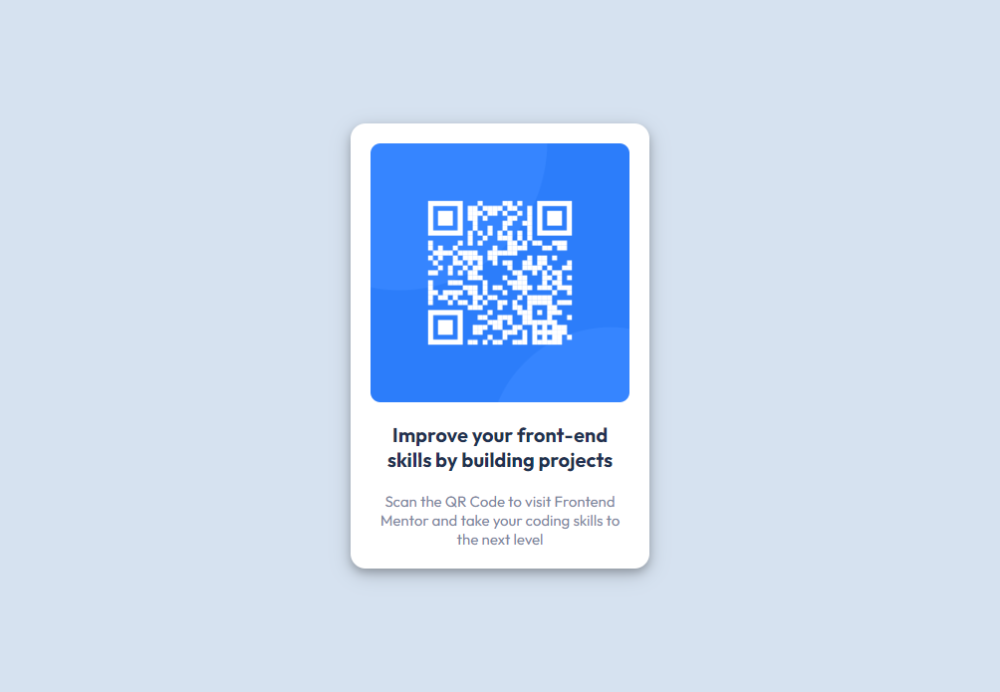

# Frontend Mentor - QR code component solution

This is a solution to the [QR code component challenge on Frontend Mentor](https://www.frontendmentor.io/challenges/qr-code-component-iux_sIO_H). Frontend Mentor challenges help you improve your coding skills by building realistic projects.

## Table of contents

- [Overview](#overview)
  - [Screenshot](#screenshot)
  - [Links](#links)
- [My process](#my-process)
  - [Built with](#built-with)
  - [What I learned](#what-i-learned)
  - [Continued development](#continued-development)
  - [Useful resources](#useful-resources)
- [Author](#author)
- [Acknowledgments](#acknowledgments)

## Overview

### Screenshot



### Links

- Solution URL: https://www.frontendmentor.io/solutions/qr-code-component-main-_V_5tk9jcL
- Live Site URL: https://gentle-cucurucho-5b2875.netlify.app/

## My process

1. Plan and outline the website
2. Set up the project
3. Add HTML5 semantic tags
4. Add CSS custom properties
5. Use Flexbox for layout
6. Style the website
7. Test and refine
8. Deploy the website

### Built with

- Semantic HTML5 markup
- CSS custom properties
- Flexbox

### What I learned

1. Structuring content by using semantic HTML5 tags such as `<main>`
2. Styling with CSS
3. Using CSS custom properties

```css
:root {
  --white: hsl(0, 0%, 100%);
  --light-gray: hsl(212, 45%, 89%);
  --grayish-blue: hsl(220, 15%, 55%);
  --dark-blue: hsl(218, 44%, 22%);
}

main {
  background: var(--light-gray);
}

.card {
  background: var(--white);
}

.card h1 {
  color: var(--dark-blue);
}

.card p {
  color: var(--grayish-blue);
}
```

4. Using Flexbox to create a responsive layout for the website

```css
main {
  display: flex;
  align-items: center;
  justify-content: center;
}
```

5. Following best practices such as using semantic HTML5 markup, CSS custom properties, and Flexbox

### Continued development

As of the writing of this section, I have no areas that I want to continue focusing on more in future projects.

### Useful resources

- [CSS Box Shadow](https://www.w3schools.com/css/css3_shadows_box.asp) - This helped me to create paper-like cards for the QR Code card. I really liked this styling and will use it going forward when creating paper-like cards in the future.

## Author

- Frontend Mentor - [@erlanggaadptr](https://www.frontendmentor.io/profile/erlanggaadptr)

## Acknowledgments

I want to give a hat tip to W3Schools for providing guide on CSS styling, especially for the box-shadow property
